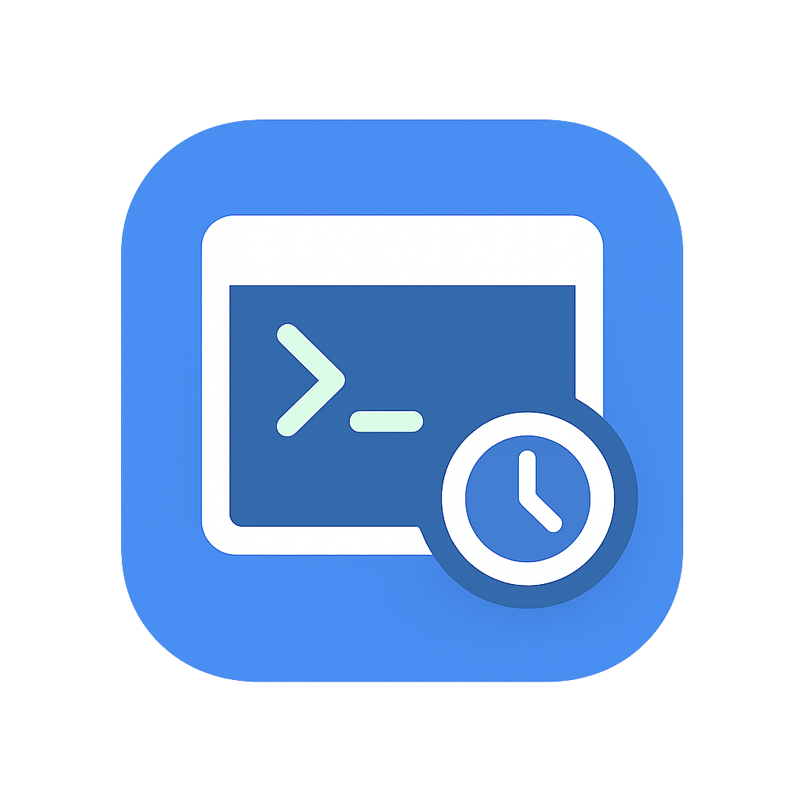

<div align="center" id="top"> 
  

&#xa0;

</div>

<p align="center">
  

  

  

  

  

  

   
</p>

<h4 align="center">
	🚧 Under developing...  🚧
</h4>

<hr>

<p align="center">
  <a href="#dart-about">About</a> &#xa0; | &#xa0;
  <a href="#computer-demo">Demo</a> &#xa0; | &#xa0;
  <a href="#sparkles-features">Features</a> &#xa0; | &#xa0;
  <a href="#rocket-technologies">Technologies</a> &#xa0; | &#xa0;
  <a href="#white_check_mark-requirements">Requirements</a> &#xa0; | &#xa0;
  <a href="#checkered_flag-installation">Installation</a> &#xa0; | &#xa0;
  <a href="#bookmark_tabs-getting-started">Getting Started</a> &#xa0; | &#xa0;
  <a href="#memo-license">License</a>
</p>

<br>

<p align="center">
  <a title="This tool is Tool of The Week on Terminal Trove, The $HOME of all things in the terminal" href="https://terminaltrove.com/">
    
  </a>
</p>

## :dart: About

Cronboard is a terminal application that allows you to manage and schedule cronjobs on local and remote servers. With Cronboard, you can easily add, edit, and delete cronjobs, as well as view their status.

## :computer: Demo

<div align="center" id="top">
  

&#xa0;

</div>

## :sparkles: Features

:heavy_check_mark: Check cron jobs\
:heavy_check_mark: Create cron jobs with validation and human-readable feedback\
:heavy_check_mark: Pause and resume cron jobs\
:heavy_check_mark: Edit existing cron jobs\
:heavy_check_mark: Delete cron jobs\
:heavy_check_mark: View formatted last and next run times\
:heavy_check_mark: Accepts `special expressions` like `@daily`, `@yearly`, `@monthly`, etc.\
:heavy_check_mark: Connect to servers using SSH, using password or SSH keys \
:heavy_check_mark: Choose another user to manage cron jobs if you have the permissions to do so (`sudo`)

## :rocket: Technologies

The following tools were used in this project:

- [Textual](https://textual.textualize.io)
- [Python crontab](https://pypi.org/project/python-crontab/)
- [Paramiko](https://github.com/paramiko/paramiko)
- [Cron descriptor](https://github.com/Salamek/cron-descriptor)

## :white_check_mark: Requirements

Before starting :checkered_flag:, be sure you have cron installed on your machine.

```bash
crontab -l
```

## :checkered_flag: Installation

#### Manual Installation

```bash
git clone https://github.com/antoniorodr/cronboard

cd cronboard

pip install .
```

#### Homebrew Installation

```bash
brew tap antoniorodr/cronboard
brew install antoniorodr/cronboard/cronboard
```

#### Installation using [uv](https://docs.astral.sh/uv/)

```bash
uv tool install git+https://github.com/antoniorodr/cronboard
```

#### AUR Installation

```bash
yay -S cronboard
```

## :bookmark_tabs: Getting Started

One installed, you can run the application using the following command:

```bash
cronboard
```

That's it! You can now start using Cronboard to manage your cron jobs.

Cronboard is equiped (thanks to [Textual](https://textual.textualize.io)) with a footer that shows you the available commands.

When connecting to a remove server with a SSH key, Cronboard will look for the `known_hosts` file in the default location (`~/.ssh/known_hosts`).

If you choose to manage cron jobs for another user, make sure you have the necessary permissions to do so. This means you will not able to do it if you are not a `sudoer`.

## :memo: License

This project is under license from MIT. For more details, see the [LICENSE](LICENSE.md) file.

## :eyes: Do you like my work?

If you like my work and want to support me, you can buy me a coffee ☕ or even a burrito 🌯 by sponsoring me.

[](https://github.com/sponsors/antoniorodr)

&#xa0;

<a href="#top">Back to top</a>
